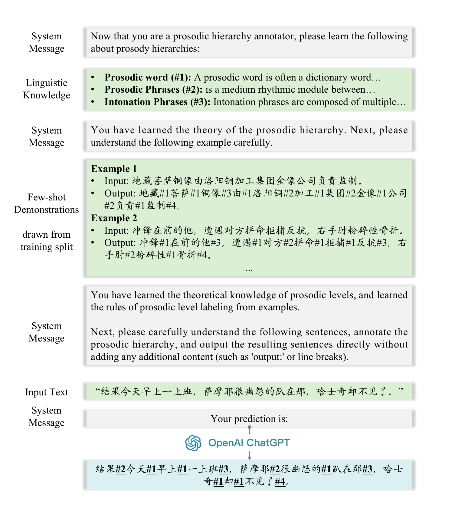
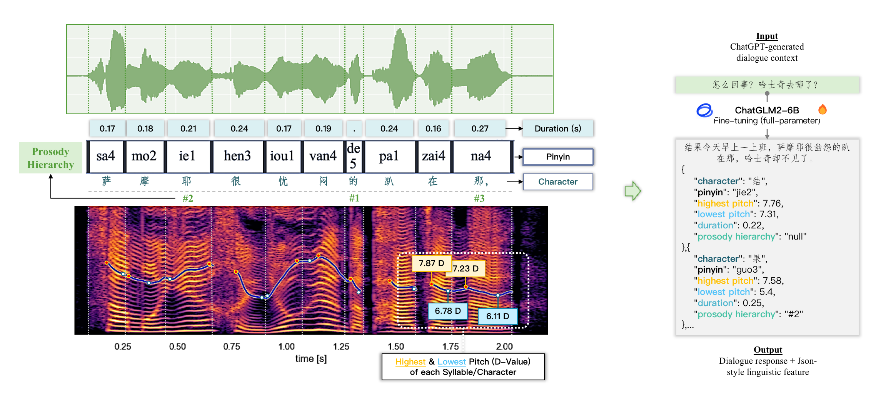

<div align="center">

## 🎙 Towards Joint Modeling of Dialogue Response and Speech Synthesis based on Large Language Model 

[Xinyu Zhou (周欣宇)](https://www.linkedin.com/in/xinyu-zhou2000/)
, &nbsp; &nbsp; 
[Delong Chen (陈德龙)](https://chendelong.world/)
, &nbsp; &nbsp; 
[Yudong Chen (陈玉东)](https://rwxy.cuc.edu.cn/2019/0730/c5134a133504/pagem.htm)


 &nbsp; &nbsp; &nbsp; &nbsp; &nbsp; &nbsp; 
 

[ArXiv](https://arxiv.org/abs/2309.11000) | 
[Poster](doc/YFRSW_Poster.pdf) | 
[Notebook](prosody_prediction.ipynb) | 
[Checkpoint](https://huggingface.co/chendelong/ChatGLM-PSP)

</div>

This project explores the potential of constructing an AI spoken dialogue system that *"thinks how to respond"* and *"thinks how to speak"* simultaneously, which more closely aligns with the human speech production process compared to the current cascade pipeline of independent chatbot and Text-to-Speech (TTS) modules. 

We hypothesize that *Large Language Models (LLMs)* with billions of parameters possess significant speech understanding capabilities and can jointly model dialogue responses and linguistic features. We conduct two sets of experiments: 

- **Study 1**: We investigate the task of Prosodic structure prediction (PSP), a typical front-end task in TTS, demonstrating the speech understanding ability of LLMs; 
- **Study 2**: We further integrated dialogue response and a wide array of linguistic features using a unified encoding format, and fine-tuned an LLM to learn them jointly.

## News
- **2023.09.21**. Welcome to the official repo of our paper *"Towards Joint Modeling of Dialogue Response and Speech Synthesis based on Large Language Model"*! We have released the code, dataset, and the checkpoint. Our paper is available at arXiv! [(arxiv link)](https://arxiv.org/abs/2309.11000)

- **2023.05.20**. This project is accepted by [Young Female Researchers in Speech Workshop (YFRSW)](https://sites.google.com/view/yfrsw-2023/home) at [Interspeech 2023](https://www.interspeech2023.org/) for a poster presentation! See the poster [here](doc/YFRSW_Poster.pdf).


## **[Study 1]** Prosodic Structure Prediction (PSP) based on LLM

We utilize the DataBaker open-source Chinese Standard Mandarin Speech Corpus, which contains 10-hour speech recordings of 10,000 sentences with an average length of around 16 words per sentence. It was articulated by a single Chinese female speaker. The corpus also encompasses diverse domains, including news, novels, technology, entertainment, etc. The data is available for download [here](https://www.data-baker.com/data/index/TNtts/) provided by DataBaker.

The dataset is randomly divided into an 8k train set and a 1k test set. We provide the data in the [`data/databaker_prosody`](data/databaker_prosody) folder.


### Prompting-based PSP

The following figure illustrates our proposed prompt structure for LLM (ChatGPT)-based prosodic structure prediction. We incorporate expert linguistic knowledge and few-shot demonstrations to enable LLMs to perform the prosodic structure prediction task.

<p align="center">
  
</p>


We provide a [jupyter notebook](prosody_prediction.ipynb) for the implementation of ChatGPT-based PSP, which we prompt ChatGPT with linguistic knowledge and few-shot demonstration to perfrom PSP. 

To run the code, please first clone this repo, and the only prerequisite to run this note bookis the installation of the `openai` package.

```bash
# clone this repo
git clone https://github.com/XinyuZhou2000/spoken-dialogue.git
cd spoken-dialogue

# install the openai package
pip install openai
```

### Fine-tuning-based PSP

We fine-tune a [ChatGLM2-6B](https://huggingface.co/THUDM/chatglm2-6b) model with P-Tuning-v2. Our implementation is based on [their official codebase](https://github.com/THUDM/ChatGLM2-6B/tree/main/ptuning). Please modify the `--train_file`, `--validation_file`, `--prompt_column`  and `--response_column` in [this script](https://github.com/THUDM/ChatGLM2-6B/blob/main/ptuning/train.sh):

```bash
torchrun --standalone --nnodes=1 --nproc-per-node=$NUM_GPUS main.py \
    --do_train \
    --train_file path/to/this/repo/data/databaker_prosody/chatglm_train_8k.json \
    --validation_file path/to/this/repo/data/databaker_prosody/chatglm_test_1k.json \
    ...
    --prompt_column input \
    --response_column output \
    ...
```

Our trained checkpoint is available at [this huggingface repo](https://huggingface.co/chendelong/ChatGLM-PSP).


## **[Study 2]** Joint Prediction of Dialogue Response and Linguistic Features

Our objective is to investigate the feasibility of constructing a unified model capable of simultaneously generating coherent responses to user queries in dialogues and diverse fine-grained linguistic features for TTS. 

Unfortunately, the DataBaker dataset only comprises isolated sentence recordings, and there are not any other datasets having dialogue context and parallel speech recordings or annotations. 

**Dialogue Context Generation**. Drawing inspiration from the [LongForm](https://github.com/akoksal/LongForm), we prompt ChatGPT to anticipate the dialogue context and transform it into a dataset of single-turn dialogues:


| Prompt for Dialogue Context Generation |  
| --- |
| `System Message`: Please generate the most likely sentence spoken by A based on B's response. 
 `User`: 
&nbsp;&nbsp;&nbsp;&nbsp;&nbsp;&nbsp;&nbsp;&nbsp; A:
&nbsp;&nbsp;&nbsp;&nbsp;&nbsp;&nbsp;&nbsp;&nbsp; B: *"When I went to work this morning, the Samoyed lay there resentfully, but the Husky disappeared."* 
| `ChatGPT`: A: *"What's going on? Where did the Husky go?"* |

**Linguistic Feature Extraction**. As shown on the left of the following figure, we automatically extract four categories of linguistic attributes: characters, their corresponding duration, pinyin (phonetic transcription representing character pronunciation), the prosodic hierarchy, and the highest and lowest pitch values (D-Value). The use of D-value is inspired by Shen Jiong’s theory: the D-value is a logarithmic scale used to describe pitch and quantifies the relationship between a pitch (F) in Hertz (Hz) and a reference frequency (F0). The formal definition of (D-Value) is: 
`D = 5 × log2(F/F0)`.

<p align="center">  
    

**Data Formatting**. As shown on the right side of the above figure, we format extracted linguistic features into a string of JSON-style dictionaries, and concatenate it with the response text generated by Chat-GPT, together serving as the learning target. 

We have included the constructed dataset in the [`data/spoken_dialogue`](data/spoken_dialogue) folder. The data looks like:

```json
[
    {
        "input": "我们应该坐下来讨论一下如何安排出场次序。",
        "output": "曾志伟坦言各人没有计较出场次序，但安排上仍有困难。[{\"character\": \"曾\", \"pinyin\": \"zeng1\", \"highest pitch\": 10.77, \"lowest pitch\": 9.91, \"duration\": 0.2, \"prosody hierarchy\": \"null\"}, {\"character\": \"志\", \"pinyin\": \"zhiii4\", \"highest pitch\": 10.75, \"lowest pitch\": 8.88, \"duration\": 0.15, \"prosody hierarchy\": \"null\"}, {\"character\": \"伟\", \"pinyin\": \"uei2\", \"highest pitch\": 9.37, \"lowest pitch\": 7.66, \"duration\": 0.26, \"prosody hierarchy\": \"#2\"}, {\"character\": \"坦\", \"pinyin\": \"tan3\", \"highest pitch\": 8.19, \"lowest pitch\": 5.61, \"duration\": 0.25, \"prosody hierarchy\": \"null\"}, {\"character\": \"言\", \"pinyin\": \"ian2\", \"highest pitch\": 7.43, \"lowest pitch\": 5.4, \"duration\": 0.25, \"prosody hierarchy\": \"#2\"}, {\"character\": \"各\", \"pinyin\": \"ge4\", \"highest pitch\": 9.19, \"lowest pitch\": 7.27, \"duration\": 0.15, \"prosody hierarchy\": \"null\"}, {\"character\": \"人\", \"pinyin\": \"ren2\", \"highest pitch\": 8.25, \"lowest pitch\": 6.38, \"duration\": 0.21, \"prosody hierarchy\": \"#2\"}, {\"character\": \"没\", \"pinyin\": \"mei2\", \"highest pitch\": 10.33, \"lowest pitch\": 7.46, \"duration\": 0.14, \"prosody hierarchy\": \"null\"}, {\"character\": \"有\", \"pinyin\": \"iou3\", \"highest pitch\": 10.54, \"lowest pitch\": 7.33, \"duration\": 0.15, \"prosody hierarchy\": \"#1\"}, {\"character\": \"计\", \"pinyin\": \"ji4\", \"highest pitch\": 7.99, \"lowest pitch\": 6.81, \"duration\": 0.14, \"prosody hierarchy\": \"null\"}, {\"character\": \"较\", \"pinyin\": \"jiao4\", \"highest pitch\": 7.61, \"lowest pitch\": 5.78, \"duration\": 0.17, \"prosody hierarchy\": \"#1\"}, {\"character\": \"出\", \"pinyin\": \"chu1\", \"highest pitch\": 8.04, \"lowest pitch\": 5.78, \"duration\": 0.15, \"prosody hierarchy\": \"null\"}, {\"character\": \"场\", \"pinyin\": \"chang3\", \"highest pitch\": 7.71, \"lowest pitch\": 4.43, \"duration\": 0.21, \"prosody hierarchy\": \"#1\"}, {\"character\": \"次\", \"pinyin\": \"cii4\", \"highest pitch\": 7.81, \"lowest pitch\": 4.91, \"duration\": 0.2, \"prosody hierarchy\": \"null\"}, {\"character\": \"序\", \"pinyin\": \"xv4\", \"highest pitch\": 6.43, \"lowest pitch\": 3.52, \"duration\": 0.26, \"prosody hierarchy\": \"#3\"}, {\"character\": \"null\", \"pinyin\": \"null\", \"highest pitch\": 0.0, \"lowest pitch\": 0.0, \"duration\": 0.19, \"prosody hierarchy\": \"null\"}, {\"character\": \"但\", \"pinyin\": \"null\", \"highest pitch\": 8.93, \"lowest pitch\": 8.31, \"duration\": 0.19, \"prosody hierarchy\": \"#1\"}, {\"character\": \"安\", \"pinyin\": \"an1\", \"highest pitch\": 10.8, \"lowest pitch\": 9.76, \"duration\": 0.17, \"prosody hierarchy\": \"null\"}, {\"character\": \"排\", \"pinyin\": \"pai2\", \"highest pitch\": 9.44, \"lowest pitch\": 5.96, \"duration\": 0.2, \"prosody hierarchy\": \"null\"}, {\"character\": \"上\", \"pinyin\": \"shang4\", \"highest pitch\": 7.81, \"lowest pitch\": 6.05, \"duration\": 0.2, \"prosody hierarchy\": \"#2\"}, {\"character\": \"仍\", \"pinyin\": \"reng2\", \"highest pitch\": 9.93, \"lowest pitch\": 5.89, \"duration\": 0.16, \"prosody hierarchy\": \"null\"}, {\"character\": \"有\", \"pinyin\": \"iou3\", \"highest pitch\": 10.54, \"lowest pitch\": 6.01, \"duration\": 0.15, \"prosody hierarchy\": \"#1\"}, {\"character\": \"困\", \"pinyin\": \"kuen4\", \"highest pitch\": 8.1, \"lowest pitch\": 6.06, \"duration\": 0.22, \"prosody hierarchy\": \"null\"}, {\"character\": \"难\", \"pinyin\": \"nan5\", \"highest pitch\": 6.06, \"lowest pitch\": 3.73, \"duration\": 0.25, \"prosody hierarchy\": \"#4\"}]"
    }
]
```

We use this dataset to fine-tune ChatGLM2-6B. Note that here we perform full-parameter fine-tuning (*i.e.,* [this script](https://github.com/THUDM/ChatGLM2-6B/blob/main/ptuning/ds_train_finetune.sh)), as P-tuning-based PEFT has limited learning capacity.


### Acknowledgment & Citation

Xinyu Zhou and Delong Chen contributed equally.
This work is partially supported by National Social Science Fund of China (20&ZD295).

If you find this work useful, please consider citing our paper as:

```bibtex
@article{zhou2023joint,
      title={Towards Joint Modeling of Dialogue Response and Speech Synthesis based on Large Language Model}, 
      author={Xinyu Zhou and Delong Chen and Yudong Chen},
      year={2023},
      eprint={2309.11000},
      archivePrefix={arXiv},
      primaryClass={cs.CL}
}
```
